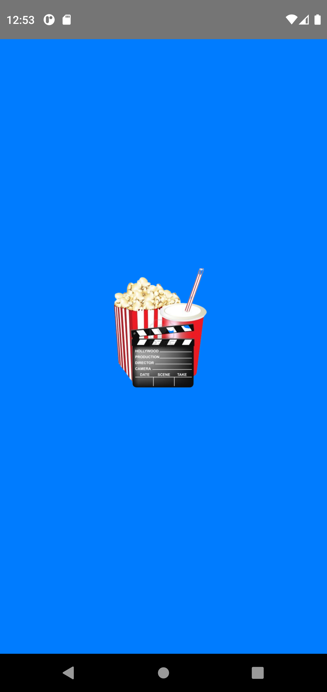
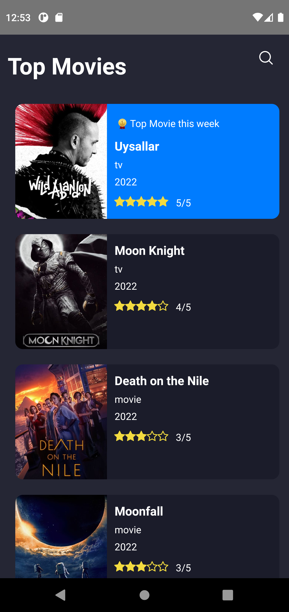
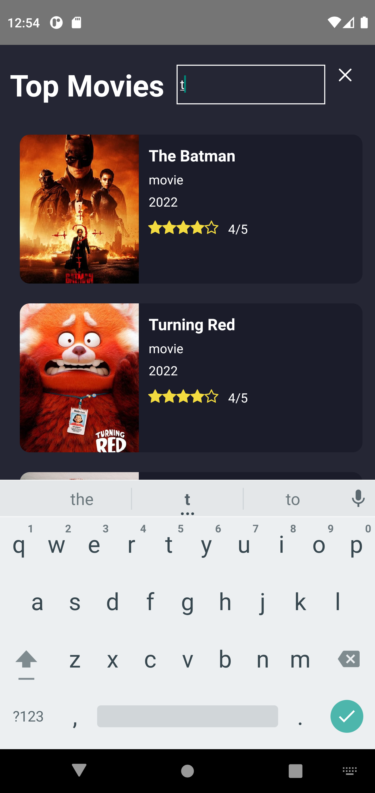
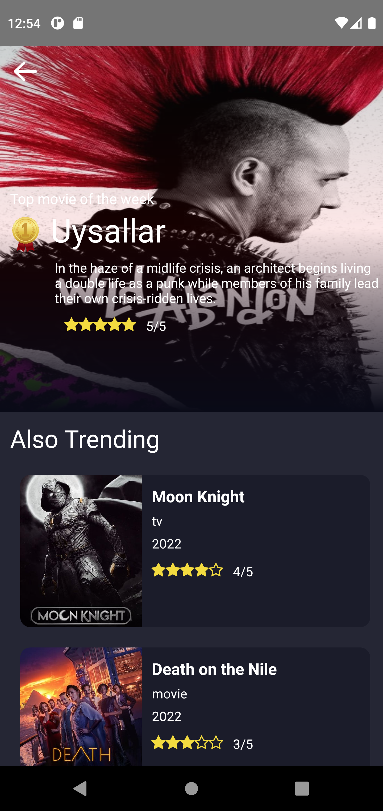
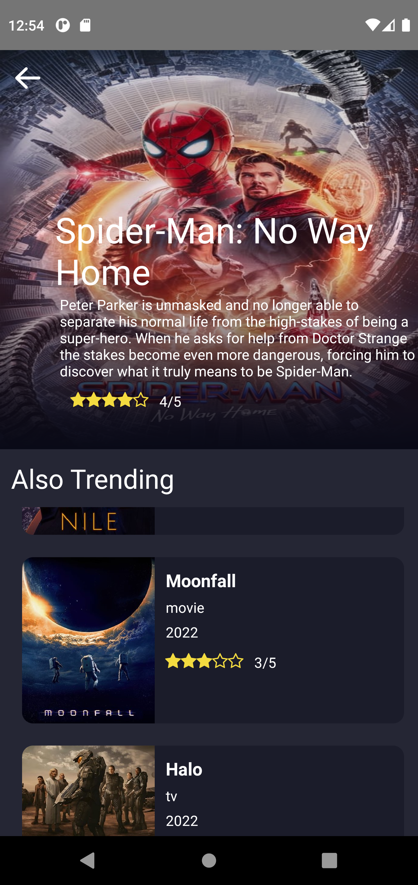

<h1 align="center">
  <a href="#">
    MovieDBApp
  </a>
</h1>

<p align="center">
  <a href="https://opensource.org/licenses/MIT">
    
  </a>
</p>

## Contents

## 📜 Getting Started

1. Download and configure [Node.js](https://nodejs.org/en/download/).
2. Go to the desired folder and clone the project using git.

If Node.js is installed globally, run

```bash
git clone https://github.com/Andrewananda/MovieDbApi.git
```

Run yarn to install the packages

```bash
yarn install
```

or using npm

```bash
npm install
```

There are two options after that, you can run the application for Android or for iOS
For Android run:

```bash
npm run android
```

or if using yarn

```bash
yarn android
```

For iOS(Mac required) run:

```bash
npm run ios
```

or if using yarn

```bash
yarn ios
```

For ios you might need to install pods before running.
navigate to ios folder in your project root. The run

```bash
pod install
```

##Screens

<table>
<tr>
<td>

</td>
<td>

</td>
<td>

</td>
</tr>
<td>

</td>
<td>

</td>
<td>
</tr>
</table>
